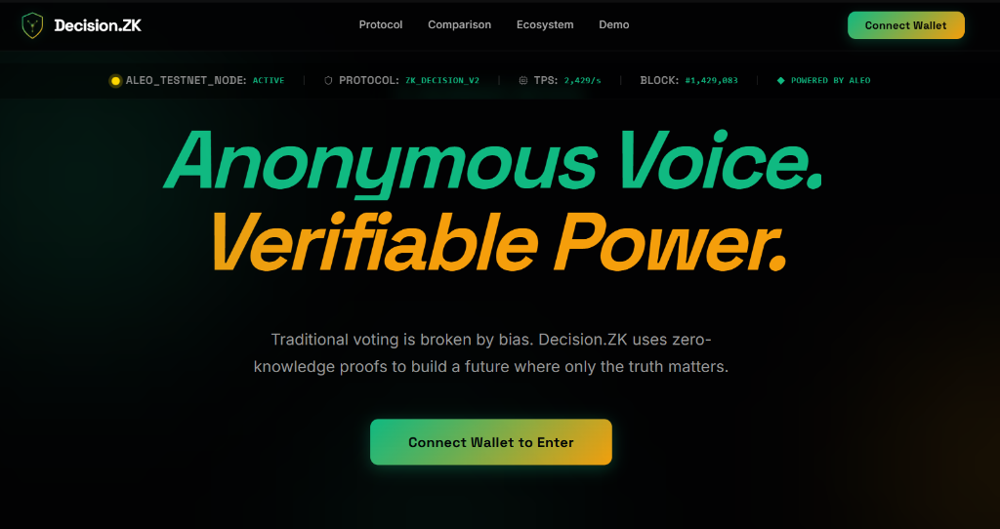
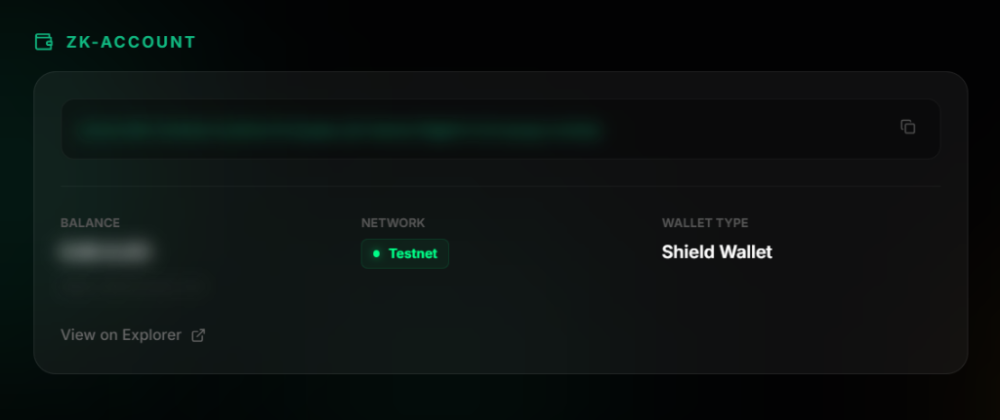
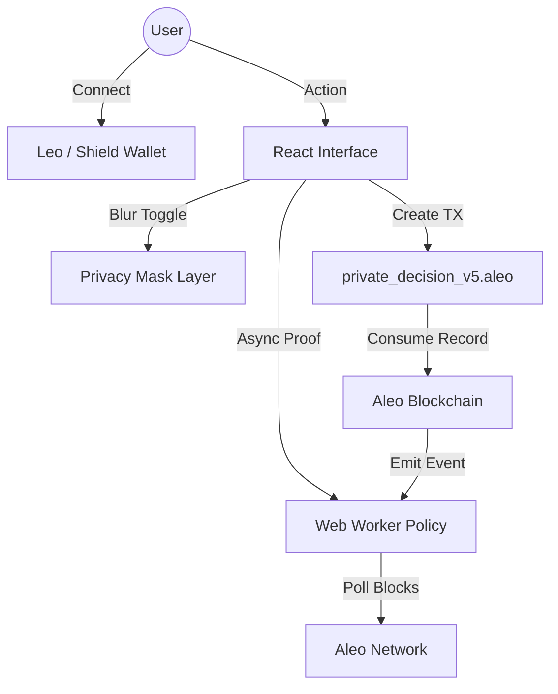

<p align="center">
  
</p>

<h1 align="center">Decision.ZK</h1>

<p align="center">
  <strong>The Private Governance Layer for the Aleo Ecosystem</strong>
</p>

<p align="center">
  
  
  
  
</p>

---

## 🛡️ Overview

**Decision.ZK** is a privacy-first governance platform built natively on the Aleo blockchain. It leverages Zero-Knowledge Proofs (ZKPs) to enable truly anonymous voting and reputation-based signaling, while implementing economic safeguards (Sybil resistance) to ensure a high-signal environment.

In a world where public voting leads to herd mentality and coercion, Decision.ZK provides a "Blind Tally" mechanism where decisions are verified by math, not public exposure.

---

## ✨ Key Features

### 1. 🗳️ Blind Voting (ZK-Records)
Votes are cast as private Aleo records. The application generates a ZK-proof locally, consuming your reputation/stake record and emitting a commitment to the choice without revealing the choice itself or your identity until the protocol-defined reveal phase.

### 2. 🕵️ Privacy Mask (Streamer Mode)
A professional-grade UI feature for secure public demonstrations. With a single click, the **Privacy Mask** applies an 8px Gaussian blur to all sensitive wallet balances, reputation metrics, and public addresses across the entire dashboard.

### 3. 🛡️ Sybil Resistance
To prevent governance spam, the protocol enforces an **Economic Stake Barrier**. Creating proposals and significant voting actions require a refundable reliability stake, ensuring that every interaction has "skin in the game."

### 4. 🔄 Worker Sync Architecture
Utilizes **Web Workers** for non-blocking background polling of the Aleo blockchain. This ensures the UI remains snappy while the background thread monitors transaction finality and record synchronization.

---

## 📸 Interface Preview

| Dashboard Overview | Privacy Mode (Active) |
|:---:|:---:|
|  |  |
| *Modern Emerald-to-Amber Terminal UI* | *8px Security Blur on sensitive data* |

---

## 🏗 Architecture



---

## 🛠 Tech Stack

| Component | Technology | Description |
|:--- |:--- |:--- |
| **Blockchain** | Aleo Testnet Beta | High-performance privacy L1 |
| **Language** | Leo | ZK-Circuit definition & state logic |
| **Frontend** | React 18 + Vite | Modern, blazing-fast reactive UI |
| **Styling** | Vanilla CSS | Custom Glassmorphism & Neon aesthetic |
| **State** | Context API | Global Privacy & Wallet state management |
| **Worker** | Web Workers | Multithreaded blockchain synchronization |

---

## 🚀 Installation & Setup

### Prerequisites
- [Node.js](https://nodejs.org/) (v18+)
- [Leo Wallet](https://www.leo.app/) or [Shield Wallet](https://shieldwallet.io/)

### Local Development

1. **Clone and Install**
   ```bash
   git clone https://github.com/your-repo/decision-zk.git
   cd decision-zk
   npm install
   ```

2. **Environment Configuration**
   Create a `.env` file in the root:
   ```env
   VITE_ALEO_NETWORK=testnetbeta
   VITE_PROGRAM_ID=private_decision_v5.aleo
   ```

3. **Launch Terminal**
   ```bash
   npm run dev
   ```

---

## 📜 Smart Contract

The core logic is deployed at:
`private_decision_v5.aleo`

| Transition | Purpose | Visibility |
|:--- |:--- |:--- |
| `create_dilemma` | Create a new proposal with stake | Public/Private Hybrid |
| `vote_private` | Shielded voting on post | Private |
| `unlock_content` | Rep-based content access | Private |

---

## 🤝 Contributing

We welcome contributions to the privacy-first future.
1. Fork the Project
2. Create your Feature Branch (`git checkout -b feature/AmazingFeature`)
3. Commit your Changes (`git commit -m 'Add AmazingFeature'`)
4. Push to the Branch (`git push origin feature/AmazingFeature`)
5. Open a Pull Request

---

<p align="center">
  Built with 🛡️ during the Aleo Hackathon 2026
</p>
